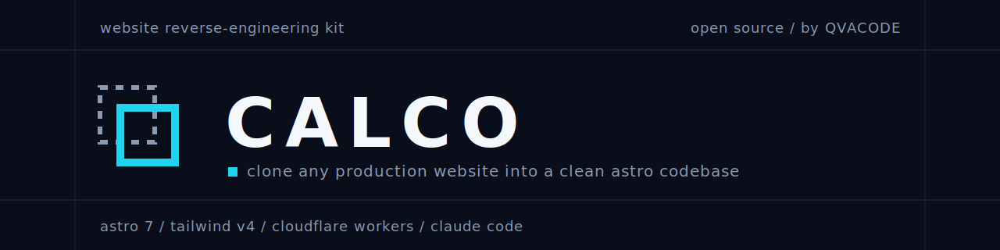

<p align="center">
  
</p>

<p align="center">
  <a href="https://qvacode.github.io/calco/"></a>
  
  
  
  
  <a href="LICENSE"></a>
</p>

<p align="center"><b>English</b> · <a href="README.es.md">Español</a></p>

# Calco

**Clone any production website into a clean, static Astro codebase you own.**

*Calco* is Spanish for a tracing, an exact copy. Point it at a URL from Claude Code and it
captures the site's real HTML and CSS, extracts the design system into auditable artifacts,
and rebuilds the page section by section as an [Astro 7](https://astro.build) +
[Tailwind CSS v4](https://tailwindcss.com) project that deploys to Cloudflare in one command.

## Why founders use this

A serious company's production website is not a mockup. It is the surviving result of months
of design, UX and conversion research — every spacing decision, every headline hierarchy,
every interaction already tested against real traffic. Calco turns that validated ground into
your starting codebase:

- **Speed with validated results.** A pixel-perfect rebuild in hours, not a redesign project
  in weeks. Start from patterns that already work, then make them yours.
- **Real code, not a scrape.** Clean `.astro` components, design tokens in `@theme`,
  self-hosted assets, vanilla JS + GSAP for motion. Zero framework runtime by default.
- **Production-ready by default.** TypeScript strict, ESLint, Prettier, SEO shell, and a
  one-command Cloudflare Workers deploy are already wired.

## Proof

Judge it yourself — we pointed Calco at one of the hardest homepages on the internet:

|              |                                                                        |
| ------------ | ---------------------------------------------------------------------- |
| **Original** | <https://tailwindcss.com>                                              |
| **Clone**    | <https://qvacode.github.io/calco/> (auto-deployed from this repo)      |
| **Source**   | [`examples/tailwindcss.com`](examples/tailwindcss.com)                 |

Everything in the demo is rebuilt as real code: the hatch-rail frame, the live bento demo
components, the inline-SVG sponsor logos, the fonts. No screenshots, no iframes.

## Quick start

You need **Node 20+** (22 recommended) and **[Claude Code](https://claude.com/claude-code)**.

```bash
# 1. Get the code — or click "Use this template" on GitHub
git clone https://github.com/qvacode/calco my-site && cd my-site

# 2. Install everything: deps + the Playwright browser used for extraction
npm run setup

# 3. Open Claude Code and clone your first site
claude
/clone-website https://example.com

# 4. Ship it
npm run deploy        # astro build && wrangler deploy
```

The MCP servers Calco needs — **Playwright** (live-site inspection) and **context7** (current
Astro/Tailwind docs) — are declared in [`.mcp.json`](.mcp.json). Claude Code picks them up
automatically when you open the folder; there is nothing else to configure.

## How it works

Calco is **source-first**: it works from the target's real markup, never from screenshots or
memory. The `/clone-website` skill orchestrates five phases:

1. **Capture** — `scripts/inspection/fetch-source.mjs` snapshots the real HTML + CSS to disk.
2. **Extract** — the `design-extractor` agent distills tokens, fonts, assets and behaviors
   into auditable artifacts (`DESIGN.md`, `BEHAVIORS.md`, per-section specs).
3. **Build** — `astro-builder` agents rebuild the global frame and each section from the real
   markup, fanned out in parallel git worktrees (max 3 at once, auto-retry on failure).
4. **Assemble** — merge worktrees, batch-download assets, wire fonts and SEO.
5. **QA** — the `design-critic` agent screenshots clone vs original at 1440 and 390 and flags
   every fidelity gap; `npm run verify` gates types, lint and build.

| Agent              | Role                                                              |
| ------------------ | ----------------------------------------------------------------- |
| `design-extractor` | inspects the live site → tokens, assets, behaviors, specs         |
| `astro-builder`    | builds one `.astro` component from a spec                         |
| `code-reviewer`    | reviews the diff for correctness, a11y, perf, fidelity            |
| `design-critic`    | visual QA diff against the original + "AI slop" audit             |
| `commit-crafter`   | Conventional Commits grouped by change                            |

Extraction is deterministic where possible: color conversion, style capture and downloads run
in Node/browser scripts (`scripts/inspection/*`), so the model spends tokens on judgment, not
grunt work. See [`docs/research/INSPECTION_GUIDE.md`](docs/research/INSPECTION_GUIDE.md).

## Commands

**In Claude Code:** `/clone-website <url>` · `/extract-design <url>` · `/build-section <spec>`
· `/review` · `/qa <url>` · `/refine` · `/commit` · `/deploy`

**npm scripts:**

| Script                            | Does                                          |
| --------------------------------- | --------------------------------------------- |
| `setup`                           | install deps + Playwright browser, run checks |
| `dev` / `build` / `preview`       | Astro dev / build → `dist/` / preview         |
| `check` / `lint` / `format`       | `astro check` / ESLint / Prettier             |
| `verify`                          | check + lint + build (run before shipping)    |
| `deploy` / `cf:preview`           | `wrangler deploy` / local Workers preview     |
| `assets:download <manifest.json>` | batch-download clone assets (concurrency 3)   |

## What you get

```
src/
  pages/            # routes (index.astro → /)
  layouts/          # BaseLayout.astro (HTML shell + SEO)
  components/       # section components + icons/ (extracted SVGs)
  styles/global.css # @import "tailwindcss" + @theme tokens (the design contract)
scripts/
  inspection/       # deterministic extraction: source capture, styles, colors
  setup.mjs         # one-shot environment setup
.claude/            # agents, skills, commands, workflows for the pipeline
.mcp.json           # Playwright + context7, preconfigured
examples/
  tailwindcss.com/  # the finished demo clone (auto-deploys to GitHub Pages)
```

## Design principles

- **Pixel-perfect emulation.** The target site *is* the design system; fidelity beats flair.
- **Real content, real assets.** Actual text, images, videos and SVGs — never placeholders.
- **No AI slop.** A taste rubric guards every ambiguous decision: no generic fonts, no
  unmotivated gradients or glassmorphism, real hierarchy.
- **Enhance deliberately.** Want to go beyond 1:1? `/refine` applies taste dials on top of
  the clone instead of improvising.

## Responsible use

Calco is a research and prototyping accelerator, not a plagiarism machine. A clone of someone
else's site is a **starting point for your own product**: respect trademarks, copyright and
brand assets; replace content, imagery and branding with your own before shipping anything
public. The bundled tailwindcss.com demo exists to prove fidelity, is `noindex`ed, and is not
affiliated with or endorsed by Tailwind Labs.

## License

[MIT](LICENSE) © 2026 David E. Hernández

---

<p align="center">
  Built by <a href="https://qvacode.com.br"><b>QVACODE</b></a> — growth engineering for founders and SaaS.<br />
  <a href="https://qvacode.com.br">qvacode.com.br</a> ·
  <a href="https://www.linkedin.com/in/ernesto-growth">LinkedIn</a> ·
  <a href="https://x.com/qvacode">X</a>
</p>
